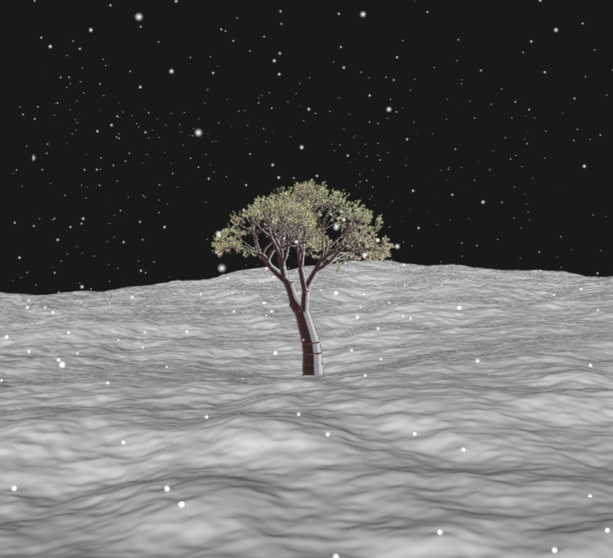
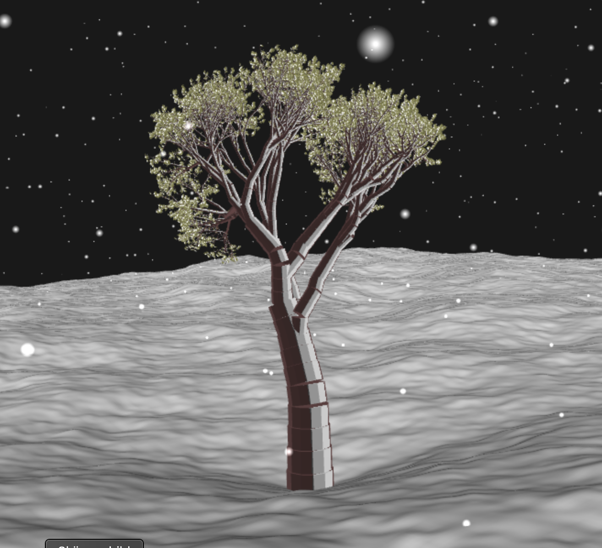

# TNM084 Procedural generation of a tree with Lindenmayer Systems

[Demo link](https://iriskotsinas.github.io/TNM084-L-System-Project/)

 

***

## Technical specifications

### Tree
A tree was created with the use of an L-system. An L-system class was created in order to read and generate the grammar string. The program was given an axiom and a grammar in order to generate branches and leaves. A turtle class was created in order to perform the rules given. The rules are as follows below:

         F -> Move forward and draw geometry
         [ -> Branch start (push state)
         ] -> Branch end (pop state)  
         ~ -> Rotate turtle (up to 10 degrees right)
         + -> Rotate turtle (up to 30 degrees right)
         - -> Rotate turtle (up to 30 degrees left)
         * -> Draw leaf

Instancing was used to increase the performance of the application, and was done by calling *gl.drawElementsInstanced* instead of *gl.drawElements*, with an extra parameter indicating how many instances there should be. This was used for both the leaves and the branches.

The axiom and grammar used initally in the application is below:

**Axiom**: FF~F~F~[X]FFF+X

**Grammar**: X = FF*[-FF-FF+F-FF\*X[X[X]]FFF-FF\*X][-FFF+F+FF\*X[X[X]]]

### Terrain
A terrain was generated for the scene by creating a plane and then applying noise to it in the vertex shader to add displacement. Fractal Brownian Motion was applied to the plane, which added interesting shapes to it. The plane was made to resemble a ground covered in snow, and was therefore given a white color with some lambertian shading in the fragment shader.

### Snowflakes
In order to successfully generate snowflakes, instancing was used. This was done similarly to the use of instancing for the branches and leaves, by calling  *gl.drawElementsInstanced*. A simple square was created, which then was modified in the fragment shader to resemble a snowflake. The snowflakes were created as billboards, where each corner of the billboard is at the center position, displaced by the camera’s up and right vectors.

***

## GUI
The user is given the option to change the axiom and grammar, and apply them to the tree. If the user enters an unknown symbol to the system, it will be ignored.

The user can also change the iteration count. As the iteration count increases the leaves become more apparent.

The user can change the snowflake count as well.

When the "generate"-button is clicked, a new tree is generated with the changes of the input as well as with new random values such as the angles.